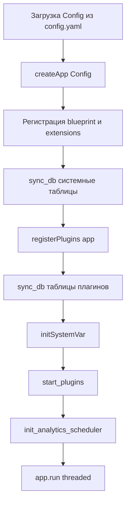

# Порядок запуска

Этот документ описывает фактический порядок инициализации из `main.py` и `app.createApp(...)`.

## Диаграмма старта

## Порядок старта

1. Загружается `Config` из `config.yaml` (`app/configuration.py`).
2. Выполняется `app = createApp(Config)`.
3. Внутри `createApp`:
   - Создается Flask-приложение и настраиваются расширения.
   - Регистрируются core-blueprint'ы (`api`, `auth`, `admin`, `files`).
   - Вызывается `sync_db(app)` для системных таблиц.
   - `registerPlugins(app)` находит и инициализирует активные плагины.
   - Повторно вызывается `sync_db(app)` для таблиц плагинов.
   - Строится Intelli-кеш.
4. В `main.py` до `app.run(...)`:
   - `initSystemVar()` в app context.
   - `start_plugins()` (вызывает `initialization()` у плагинов, затем стартует `cycle`-потоки).
   - `startSystemVar()`.
   - `init_analytics_scheduler()` в app context.
5. Стартует Flask-сервер с `threaded=True`.

## Почему `sync_db(...)` вызывается дважды

- Первый вызов синхронизирует базовую схему ядра.
- После загрузки плагинов становятся доступны их модели.
- Второй вызов синхронизирует таблицы плагинов.

## См. также

- [Architecture](ARCHITECTURE.md)
- [Core Runtime](CORE_RUNTIME.md)
- [Безопасность и доступ](SECURITY_ACCESS.ru.md)
- [Согласованность и часовые пояса](CONSISTENCY_TIMEZONES.ru.md)

## Ключевые файлы

- `main.py`
- `app/__init__.py` (`createApp`)
- `app/core/main/PluginsHelper.py`
- `app/database.py` (`sync_db`)
