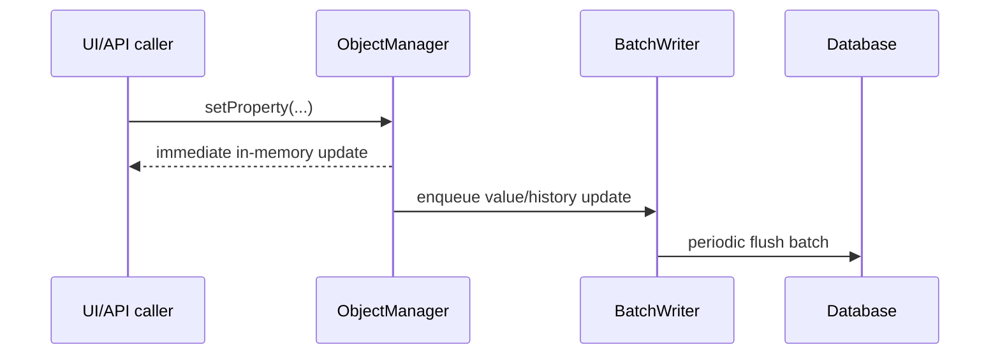

# Consistency & Timezones

This page explains data consistency and date/time behavior in osysHome.

## Write/Read Consistency Diagram

## BatchWriter and Eventual Consistency

Property value/history writes are batched by `BatchWriter` (`ObjectManager.py`).

Implications:

- `setProperty(...)` updates in-memory state immediately.
- DB/history flush is asynchronous.
- Very recent changes can appear in UI/API before they are fully persisted.

Tune with `application.batch_writer_flush_interval` in `config.yaml`.

## History Behavior

History retention is controlled by property `history` and optional `save_history` override in `setProperty(...)`.

- `history > 0`: history is stored by default.
- `history = 0`: history is not stored.
- `history < 0`: history is off by default, can be enabled per write.

## Time Conversion Diagram

## UTC vs Local Time

Internal storage uses naive UTC datetimes.

Conversion helpers:

- `convert_utc_to_local(...)`
- `convert_local_to_utc(...)`
- `get_now_to_utc()`

Scheduler/history APIs convert user-local datetime inputs to UTC for queries.

## SQLite Concurrency Note

For SQLite, WAL mode is enabled (`PRAGMA journal_mode=WAL`) to reduce lock contention.

## Related Docs

- [Core Runtime](CORE_RUNTIME.md)
- [Architecture](ARCHITECTURE.md)
- [Boot Sequence](BOOT_SEQUENCE.md)

## Key References

- `app/core/main/ObjectManager.py`
- `app/database.py`
- `app/core/lib/common.py`
- `docs/CORE_RUNTIME.md`
