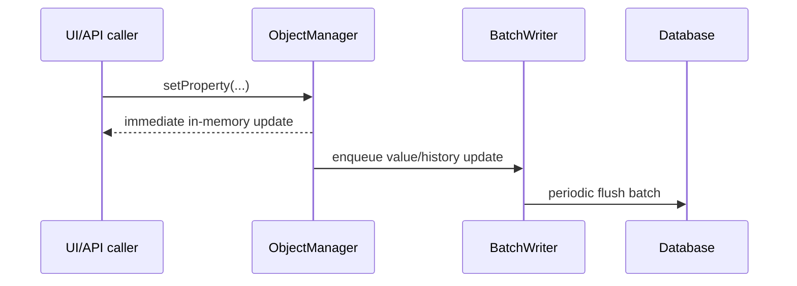

# Consistency & Timezones

This page explains data consistency and date/time behavior in osysHome.

## Write/Read Consistency Diagram

```mermaid
sequenceDiagram
  participant UI as UI/API caller
  participant OM as ObjectManager
  participant BW as BatchWriter
  participant DB as Database

  UI->>OM: setProperty(...)
  OM-->>UI: immediate in-memory update
  OM->>BW: enqueue value/history update
  BW->>DB: periodic flush batch
```

## BatchWriter and Eventual Consistency

Property value/history writes are batched by `BatchWriter` (`ObjectManager.py`).

Implications:

- `setProperty(...)` updates in-memory state immediately.
- DB/history flush is asynchronous.
- Very recent changes can appear in UI/API before they are fully persisted.

Tune with `application.batch_writer_flush_interval` in `config.yaml`.

## History Behavior

History retention is controlled by property `history` and optional `save_history` override in `setProperty(...)`.

- `history > 0`: history is stored by default.
- `history = 0`: history is not stored.
- `history < 0`: history is off by default, can be enabled per write.

## Time Conversion Diagram

```mermaid
flowchart LR
  A[User local datetime] --> B[convert_local_to_utc]
  B --> C[UTC stored/query in DB]
  C --> D[convert_utc_to_local]
  D --> E[UI/API local view]
```

## UTC vs Local Time

Internal storage uses naive UTC datetimes.

Conversion helpers:

- `convert_utc_to_local(...)`
- `convert_local_to_utc(...)`
- `get_user_timezone()` / `get_default_timezone()`
- `get_now_to_utc()`

UI timezone resolution (`get_user_timezone` / `resolve_timezone`):

1. User property `timezone` if it is a valid IANA name (not `auto`)
2. Browser: cookie `osys_tz` or header `X-Timezone` (set by `layouts/main.html`;
   WebSocket stores it on connect as `browser_timezone`)
3. `application.default_timezone`

`convert_utc_to_local` / `convert_local_to_utc` always go through `resolve_timezone`,
so callers may pass `auto` or an invalid name without raising.

Relative timers (`.time-component` / `data-start-time`):

- Attribute: **user/browser-local** via `object.getProperty(name, 'changed')`.
- Link property: `data-time-property="Object.prop"` so `changeProperty.changed` updates the
  timer without writing wall-clock into the label (avoids flicker with `changeObject`).
- Client (`custom.js`): parse naive datetime as **browser local**; relative text uses
  `Date.now()`; absolute tooltip uses the browser IANA zone (`Intl`).
- Optional API: `changed_utc` still returns stored UTC if needed elsewhere (not used by the timer).

Cron / scheduler wall clock uses `get_default_timezone()` only (not the browser).

Scheduler/history APIs convert user-local datetime inputs to UTC for queries.

## SQLite Concurrency Note

For SQLite, WAL mode is enabled (`PRAGMA journal_mode=WAL`) to reduce lock contention.

## Related Docs

- [Core Runtime](CORE_RUNTIME.md)
- [Architecture](ARCHITECTURE.md)
- [Boot Sequence](BOOT_SEQUENCE.md)

## Key References

- `app/core/main/ObjectManager.py`
- `app/database.py`
- `app/core/lib/common.py`
- `docs/CORE_RUNTIME.md`
