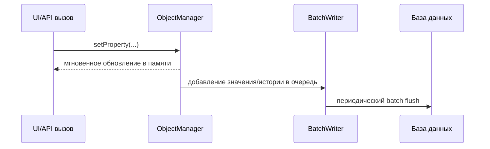

# Согласованность и часовые пояса

Этот документ описывает согласованность данных и работу со временем в osysHome.

## Диаграмма записи и чтения

## BatchWriter и eventual consistency

Запись значений/истории выполняется пакетно через `BatchWriter` (`ObjectManager.py`).

Следствия:

- `setProperty(...)` сразу обновляет состояние в памяти.
- Сброс в БД/историю идет асинхронно.
- Самые свежие изменения могут быть видны в UI/API до полной записи в БД.

Настройка: `application.batch_writer_flush_interval` в `config.yaml`.

## Поведение истории

Хранение истории зависит от параметра свойства `history` и опционального `save_history` в `setProperty(...)`.

- `history > 0`: история пишется по умолчанию.
- `history = 0`: история не пишется.
- `history < 0`: по умолчанию не пишется, но может включаться точечно.

## Диаграмма преобразования времени

## UTC и локальное время

Внутри системы время хранится как naive UTC datetime.

Функции преобразования:

- `convert_utc_to_local(...)`
- `convert_local_to_utc(...)`
- `get_now_to_utc()`

Scheduler/history API переводят пользовательские локальные даты в UTC для запросов.

## Примечание по SQLite

Для SQLite включается WAL-режим (`PRAGMA journal_mode=WAL`) для снижения конфликтов блокировок.

## См. также

- [Core Runtime](CORE_RUNTIME.md)
- [Architecture](ARCHITECTURE.md)
- [Порядок запуска](BOOT_SEQUENCE.ru.md)

## Ключевые файлы

- `app/core/main/ObjectManager.py`
- `app/database.py`
- `app/core/lib/common.py`
- `docs/CORE_RUNTIME.md`
