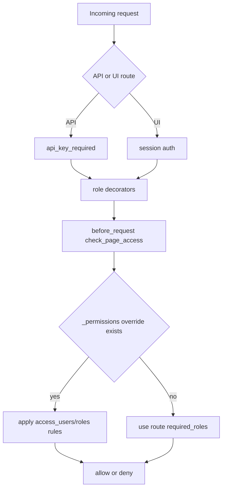

# Security & Access

This page summarizes how authentication and authorization work in the current codebase.

## Access Control Diagram



## Authentication Paths

- Session-based auth via UI login (`flask_login`).
- API key auth via query param `apikey` or header `X-API-Key`.
- API namespaces usually require `@api_key_required` plus role decorators.

## Authorization Layers

1. Route decorators (`handle_admin_required`, `handle_user_required`) define required roles.
2. `before_request` uses `check_page_access(...)` to enforce access.
3. Dynamic ACL can be provided via object properties:
   - `_permissions.blueprint:<blueprint_name>`
   - `_permissions.<endpoint_name_with_colon>`

Supported ACL fields include:

- `access_users`, `denied_users`
- `access_roles`, `denied_roles`

## API Error Behavior

- Unauthenticated API access returns JSON `401`.
- Forbidden API access returns JSON `403`.
- Non-API routes redirect to login or render forbidden page.

## Practical API Auth Example

```bash
curl "http://localhost:5000/api/object/list?apikey=<API_KEY>"

curl -H "X-API-Key: <API_KEY>" \
  "http://localhost:5000/api/property/SomeObject.someProp"
```

## Production deployment

For internet-facing installs:

- Use **nginx + HTTPS**; bind osysHome to `127.0.0.1:5000` only.
- Set `session_cookie_secure: true` in `config.yaml`.
- Do not expose port 5000 on the router.
- SQL API (`/api/sql/*`) is **admin-only** by default; override via Permissions plugin if needed.
- Routes without explicit roles are **deny-by-default** for anonymous users (public whitelist: login, static files, `/api/about`, etc.).

Step-by-step guide: [Production Deploy (nginx + HTTPS)](DEPLOY_PRODUCTION.md)

## Related Docs

- [Production Deploy](DEPLOY_PRODUCTION.md)
- [Configuration](configuration.md)
- [Web Interface](web-interface.md)
- [Core Runtime](CORE_RUNTIME.md)
- [Boot Sequence](BOOT_SEQUENCE.md)

## Key References

- `app/__init__.py` (`check_page_access`, `before_request`)
- `app/api/decorators.py` (`api_key_required`)
- `app/authentication/handlers.py` (role decorators)
