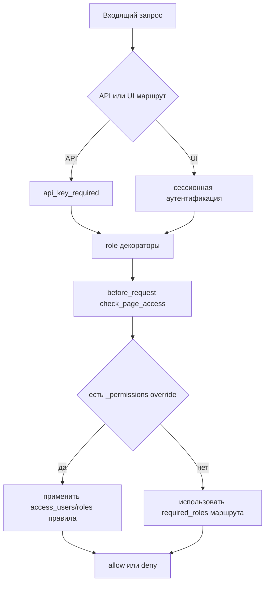

# Безопасность и доступ

Документ описывает текущую модель аутентификации и авторизации в кодовой базе.

## Диаграмма контроля доступа



## Пути аутентификации

- Сессии через web-логин (`flask_login`).
- API-ключ через query-параметр `apikey` или заголовок `X-API-Key`.
- Для API обычно используются `@api_key_required` + role-декораторы.

## Уровни авторизации

1. Декораторы маршрутов (`handle_admin_required`, `handle_user_required`) задают роли.
2. `before_request` вызывает `check_page_access(...)` и проверяет доступ.
3. Дополнительный ACL может задаваться через свойства объектов:
   - `_permissions.blueprint:<blueprint_name>`
   - `_permissions.<endpoint_name_with_colon>`

Поддерживаемые поля ACL:

- `access_users`, `denied_users`
- `access_roles`, `denied_roles`

## Поведение ошибок API

- Неаутентифицированный доступ к API: JSON `401`.
- Недостаточно прав: JSON `403`.
- Для не-API маршрутов выполняется редирект на login или страница forbidden.

## Пример аутентификации API

```bash
curl "http://localhost:5000/api/object/list?apikey=<API_KEY>"

curl -H "X-API-Key: <API_KEY>" \
  "http://localhost:5000/api/property/SomeObject.someProp"
```

## См. также

- [Веб-интерфейс](web-interface.ru.md)
- [Core Runtime](CORE_RUNTIME.md)
- [Порядок запуска](BOOT_SEQUENCE.ru.md)

## Ключевые файлы

- `app/__init__.py` (`check_page_access`, `before_request`)
- `app/api/decorators.py` (`api_key_required`)
- `app/authentication/handlers.py` (декораторы ролей)
